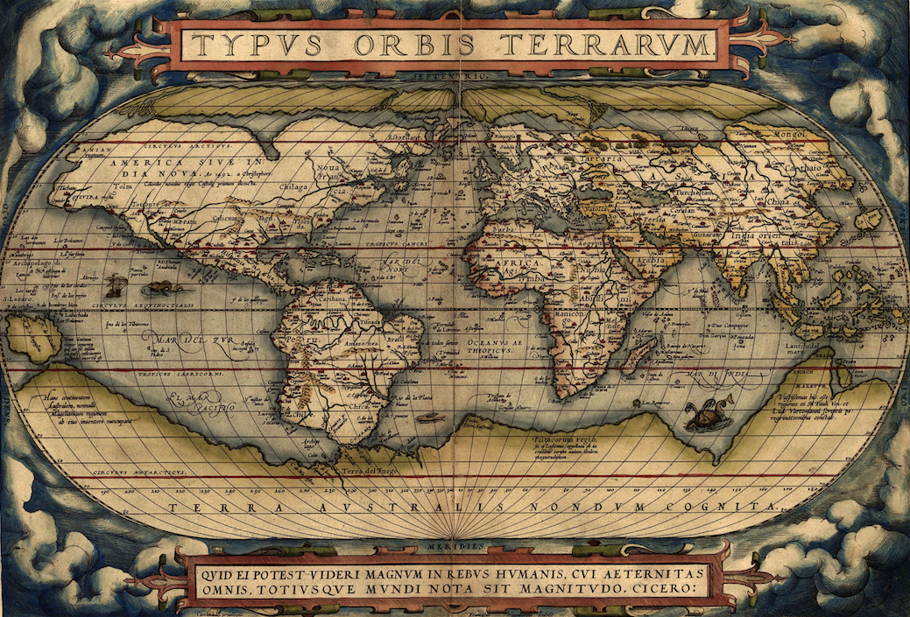
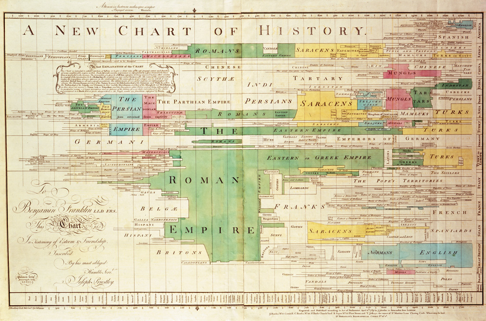
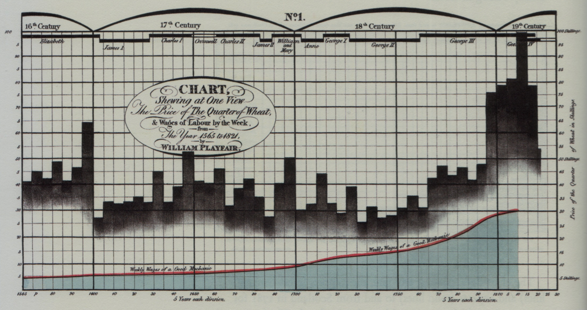

# Science et graphiques

Ce chapitre se veut une introduction générale au graphique scientifique. Il s'ouvre sur une brève histoire de la visualisation graphique des données. Le lecteur voyagera des premières cartes rudimentaires du Paléolithique jusqu'à l'époque moderne, marquée par la naissance du _dataviz_ et de l'infographie. Il n'existe pas pour l'instant de théorie complètement satisfaisante sur le graphique (même si des efforts ont été entrepris depuis la seconde moitié du XX^e^ siècle), mais nous avons tout de même souhaité fournir au lecteur quelques règles de bon usage dans l'élaboration de graphiques. C'est l'objet de la dernière partie de ce chapitre.

## Une brève histoire du graphique {#une-breve-histoire-du-graphique}

Notre époque est marquée par une véritable révolution dans notre manière d'appréhender le monde et les choses qui nous entourent. Ce monde numérique dans lequel nous vivons nous permet de quantifier et d'archiver une quantité phénoménale d'informations. Et les récents développements technologiques fournissent des outils sophistiqués pour analyser et visualiser ces données. C'est dans ce contexte que sont apparues l'infographie et la datavisualisation (également connue sous le terme de _dataviz_). Longtemps confinés dans des disciplines spécialisées, les graphiques ont envahi notre quotidien (presse écrite et en ligne, journaux télévisés, Internet, etc.) au point que certains abus et erreurs sont régulièrement commis, et les bonnes pratiques dans la conception de graphiques, héritées d'une longue évolution, sont purement écartées au profit de l'esthétisme ou de l'expérience visuelle. Ainsi, il est pertinent de se plonger dans l'histoire du graphique afin d'en dégager les principales innovations et règles de bon usage permettant d'atteindre le but principal de tout graphique : transmettre une information fidèle aux observations, de manière la plus simple sans déformer la réalité.

L'un des plus grands spécialistes de l'histoire du graphique est sans aucun doute Michael Friendly, professeur de psychologie à l'université York au Canada. Il est l'auteur de plusieurs ouvrages dédiés à l'histoire de la visualisation de l'information et des données, mais sa contribution la plus notable est son _Milestones in the History of Thematic Cartography, Statistical Graphics, and Data Visualization_[^chrono] (dont l'histoire relatée ici s'est largement inspirée), une chronologie illustrée retraçant la longue histoire de la visualisation des données et des principales innovations. Friendly reconnait plusieurs époques successives (Friendly 2008), mais dans un soucis de synthèse, nous nous limiterons aux quatre époques suivantes :

[^chrono]: http://datavis.ca/milestones/
[^calBP]: calBP, pour années _Before Present_ calibrées

- les premiers balbutiements, dont la période précède le XVIII^e^ siècle;
- l'âge d'or, s'étalant du XVIII^e^ siècle à la fin du XIX ^e^ siècle;
- l'âge sombre, couvrant la première moitié du XX ^e^ siècle;
- la renaissance du graphique, amorcée dès la seconde moitié du XX ^e^ siècle.

### Premiers balbutiements {#premiers-balbutiements}

Il serait tentant de croire que le graphique est un procédé récent, mais les premières tentatives sont très anciennes et trouvent leur origine dans la cartographie et l'astronomie, disciplines indispensables à l'exploration et à la navigation. La plus ancienne carte connue à ce jour date de 13660 calBP[^calBP] (période du Paléolithique supérieur) et a été découverte dans la cave d'Abauntz en Navarre espagnole. Il s'agit d'une carte gravée sur une roche et représentant le parcours d'une chasse à venir (ou passée) placé dans le contexte du paysage environ à la cave [@Utrilla2009].

Par la suite, on verra apparaître la première carte du monde connu (Anaximandre de Milet, 550 av. J.-C.), ainsi que la première représentation graphique de la longitude dans une carte figurant une Terre sphérique (Ptolémé, années 150 de notre ère). Au cours des siècles suivants, les découvertes successives dans le domaine de la cartographie conduiront à la réalisation du premier atlas moderne en 1570 par le cartographe néerlandais Abraham Ortelius : le _Teatrum Orbis Terrarum_, composé de 53 cartes (Figure \ref{figortelius}).

{width=95%}

C'est donc avec la cartographie que les premières représentations graphiques sont nées et ceci s'explique facilement : une carte ne requière qu'un faible niveau d'abstraction (on représente l'espace dans l'espace). Cependant, des tentatives d'abstraction plus poussées ont été entreprises afin de représenter sous forme de graphiques des informations non spatiales. Ainsi, Nicolas Oresme, évêque de Lisieux aux nombreuses activités (économiste, physicien, mathématicien, astronome, philosophe, etc.) fut le premier à représenter sous forme graphique le rapport entre deux variables (vers 1350). Sans le savoir, il fut le précurseur du système de coordonnées, bien avant René Descartes et son repère cartésien (1637). Un siècle plus tard, Nicolas Krebs (également connu sous le patronyme de Nicolas de Cuse), cardinal et grand penseur allemand à qui l'on doit de nombreux écrits astronomiques, conçoit un graphique théorique dans lequel il représente la vitesse en fonction de la distance.

Par la suite, le XVII^e^ siècle sera marqué par la profusion et l'amélioration des mesures de grandeurs physiques, l'apparition des premiers suivis socioéconomiques et le développement de nombreuses théories (géométrie analytique, erreurs et estimations des mesures, statistiques démographiques). La correspondance entre Blaise Pascal et Pierre de Fermat sera à l'origine de la théorie des probabilités, dont le premier ouvrage sur le sujet (_De ratiociniis in ludo aleae_) sera publié par Christian Huygens en 1657.

Fait marquant de ce siècle, la première visualisation graphique de données statistiques en 1644. Celle-ci est l'\oe uvre de Michael Florent van Langren, mathématicien et astronome à la cours du roi Philippe IV d'Espagne ; cette visualisation représente la variation dans la détermination de la longitude entre les villes de Tolède en Espagne et de Rome en Italie.

Ainsi, à la fin du XVII^e^ siècle, les bases seront en place pour développer le début de la pensée graphique et les nouvelles formes graphiques qui conduiront à l'âge d'or du graphique.

### L'âge d'or {#lage-dor}

Le XVIII^e^ siècle a vu apparaître de nouvelles formes graphiques afin de répondre aux besoins de l'époque. Les cartographes ont commencé à rajouter des informations non géographiques sur leurs cartes, inventant ainsi les isolignes (lignes de même valeur, Edmond Halley, 1701). Ils s'essayent également à la cartographie thématique et les premières cartes géologiques (Johann Friedrich von Charpentier, 1778), topographiques (Marcellin du Carla-Boniface, 1782) et économiques (August Friedrich Wilhelm Crome, 1782) voient le jour.

Le degré d'abstraction est poussé encore plus loin et, avec le développement des statistiques, la visualisation de fonctions théoriques commencent à se répandre (Thomas Bayes, 1763). De nouveaux suivis sont mis en place, et de nouvelles données sont récoltées conduisant à l'invention d'outils (interpolation, ajustement de courbes) et de nouvelles formes visuelles pour les analyser/représenter. C'est en 1765 que Joseph Priestley, théologien, pasteur, pédagogue et enseignant britannique, à qui l'on attribue la découverte de l'oxygène, inventa l'historiographie moderne au moyen de frises chronologiques (Figure @fig:priestley). Pour la première fois, il représente le temps par l'espace.

{#fig:priestley}

Un autre personnage majeur de ce XVIII^e^ siècle est le mathématicien-philosophe Jean-Henri Lambert. Il est le premier à utiliser les graphiques pour analyser des données empiriques et calculer les pentes de courbes. Il a également développé un système de couleurs pyramidal figurant pour la première fois la notion de saturation. Enfin, il est l'un des premiers à reconnaitre l'utilité des graphiques : _a diagram does incomparably better service here than a table_.

Cependant, ces différentes innovations graphiques étaient restreintes à quelques publications éparses, et il faudra attendre la première moitié du XIX^e^ siècle pour que le graphique statistique et la cartographie thématique se démocratisent et connaissent un essor sans précédent. On estime que vers les années 1850, les principales formes graphiques avaient été inventées.

Un des pionners de cette époque est William Playfair, ingénieur et économiste écossais, à qui l'on doit l'invention de trois graphiques majeurs constituant l'assise de la statistique graphique moderne : le diagramme en barres (1786), probablement inspiré des frises chronologiques de Priestley, le diagramme circulaire, ou camembert (1801), permettant de représenter les proportions relatives des parties au tout, et le graphique linéaire, ou série temporelle (1786), visualisant l'évolution temporelle d'une variable. Ces graphiques sont, encore aujourd'hui, considérés comme des modèles de clarté (Figure \ref{figplayfair}). En 1876, il publie _The Commercial and Political Atlas_, premier ouvrage illustré de graphiques statistiques. Ces graphiques, outre le fait d'introduire de nouvelles formes visuelles, superposent plusieurs informations permettant d'établir le rapport entre plusieurs variables. Vingt ans plus tard, Playfair publiera le _Statistical Breviary_ (1801) qui fit découvrir les premiers diagrammes circulaires.

{width=95%}

Le début de ce XIX^e^ siècle va également être marqué par les travaux du Baron Pierre Charles Dupin, à qui l'on doit la première carte chloroplète (1819) et ceux d'André-Michel Guerry, inventeur du diagramme polaire en 1829, précédant de trente ans les _coxcombs_ de Florence Nightingale, souvent reconnue comme étant la première à avoir utiliser cette forme graphique. Guerry, avec Adolphe Quetelet, a énormément contribué à la statistique morale et ses travaux sur la criminologie, largement agrémentés de cartes chloroplètes comparatives, constituent le fondement des sciences sociales modernes.

Dès les années 1820, un nombre croissant de publications scientifiques commence à contenir des graphiques. Cependant, leur usage reste purement descriptif, et il faudra encore attendre plusieurs décennies avant de voir des analyses basées sur les représentations graphiques. Progressivement, la méthode graphique commence à être reconnue dans certains cercles officiels pour ses potentiels dans le domaine de l'économie, du commerce, de l'industrie, de la planification sociale, etc.

Figure de proue de cette seconde moitié du XIX^e^ siècle, l'ingénieur civil français Charles Joseph Minard qui a su faire preuve d'une grande inventivité, notamment dans la synthèse de multiples informations sur un même graphique. Ainsi, il est l'auteur d'une cinquantaine de cartes sur lesquelles sont ajoutés des symboles proportionnels, des diagrammes circulaires, des flux de marchandises, etc. Mais, il est surtout connu pour sa carte figurative des pertes successives en hommes de l'Armée française dans la campagne de Russie en 1812--1813 (Figure \ref{figminard}), dont Edward Tufte n'hésitera pas à dire qu'il consistue le "meilleur graphique statistique jamais produit". En effet, ce graphique peut être vu comme un modèle de perfection puisqu'il figure sur un même graphique plusieurs variables : l'emplacement et l'itinéraire de l'armée française indiquant les points de séparation et de ralliement de plusieurs unités, les pertes humaines, la topographie des lieux et la température de l'air.

{width=95%}

Les innovations vont se poursuivre jusqu'à la fin du XIX^e^ siècle : carte épidémiologique (Snow, 1855), carte météorologique (Galton, 1861), cartogramme (Levasseur, 1868), diagramme illustrant la notion de corrélation (Galton, 1874), graphique en 3D (Perrozzo, 1880), carte anamorphique (Cheysson, 1888), etc. On assiste à la fin de ce siècle aux premiers inventaires des graphiques : écriture de la _Statistique graphique_ par Émile Levasseur en 1885, publication annuelle des _Albums de statistiques graphiques_ par le Ministère des travaux publics de 1879 à 1897 sous la direction d'Émile Cheysson, synthèse de l'ensemble des graphiques statistiques connus présentée à la _Statistical Society_ de Londres, etc. La fin du XIX^e^ siècle sera donc caractérisée par une large diffusion des méthodes graphiques dans différents sphères publiques.

### L'âge sombre {#lage-sombre}

- L'entrée dans le XIX^e^ siècle sera...
- Malgré cette profusion d'inventions, certains acteurs restent méfiants face à cette nouvelle méthode de travail, notamment les statisticiens britaniques qui continuent à croire que seuls les tableaux de données permettent de décrire correctement la réalité des phénomènes naturels.
- Le XX^e^ siècle : Peu d'innovations, mais des tentatives de normalisation et standardisation...

### Renaissance {#renaissance}

- Époque moderne : transition avec la section "Du bon usage des graphiques"
- Ainsi, la visualisation graphique comme procédé de transfert d'informations et de connaissances a longtemps co-évolué avec d'autres disciplines telles les mathématiques, les statistiques, l'astronomie, la médecine, les sciences sociales, les sciences économiques, le commerce, l'industrie, etc. Et, les principales innovations en la matière ont été permises grâce au développement technologique et à des avancées dans la récolte de données.

## Qu'est-ce qu'un graphique ? {#quest-ce-quun-graphique}

- Une représentation graphique, en version courte graphique, est un résumé visuel de données mesurées (ou recensées) permettant de dégager des tendances ou toute autre information (cycles, agrégation, connexion, etc.) qu'il serait difficile d'observer dans collection de nombres (stockés le plus souvent dans des tableaux). Il existe de nombreux graphiques différents : c'est la nature des données et le type d'analyses souhaité qui orienteront le choix du graphique à utiliser.
- Simplification de la réalité
- À travers l'histoire du graphique brossée dans la section précédente, différents types de representations graphiques ont été mentionnée (carte, diagramme circulaire, en barres, \ldots{}).

## Un graphique pour quoi faire ? {#un-graphique-pour-quoi-faire}

- exploration vs. présentation

## Du bon usage des graphiques {#du-bon-usage-des-graphiques}

- Dosage design / données
- Choisir le bon type de représentation (adapté aux données et à la question posée)
- Data-ink ratio; 3D; pie chart; line chart pour données continues
- Titre; repère (axe, étiquette); source des données; symbologie;
- Un graphique doit se suffire à lui-même (donc légende et clarté)
