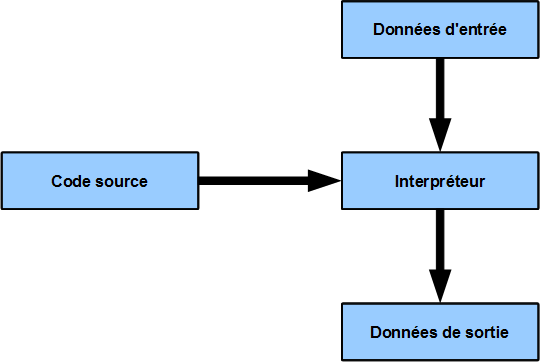
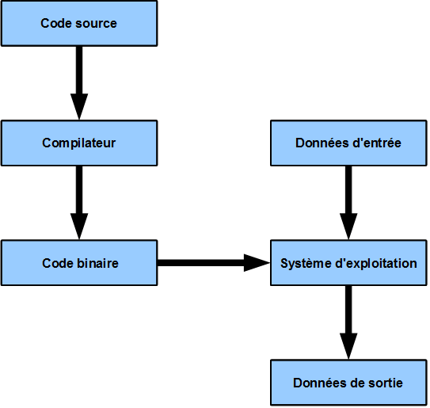
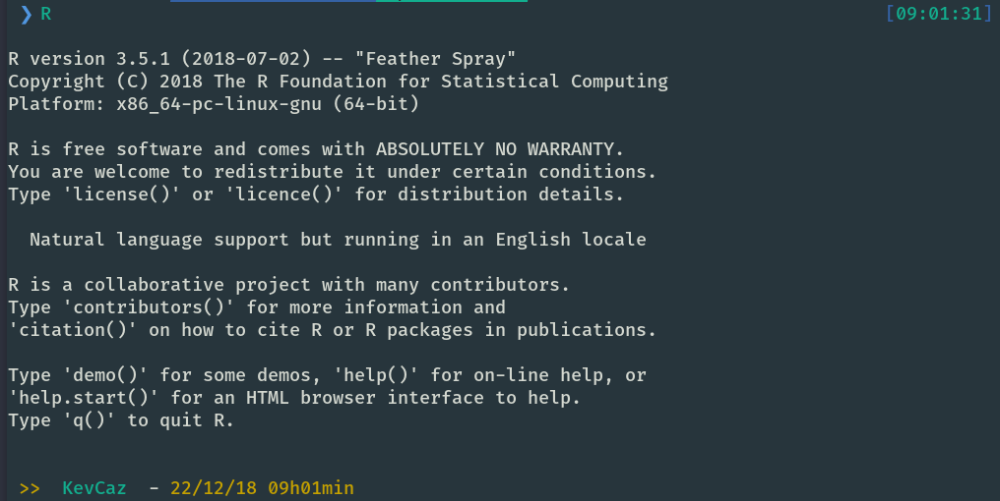
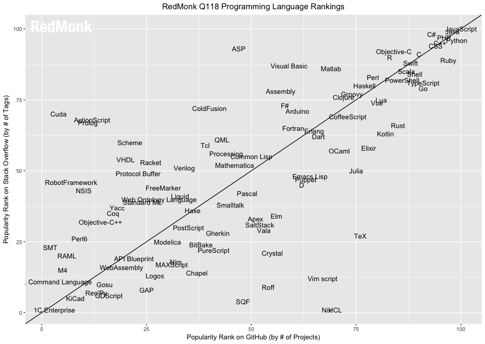
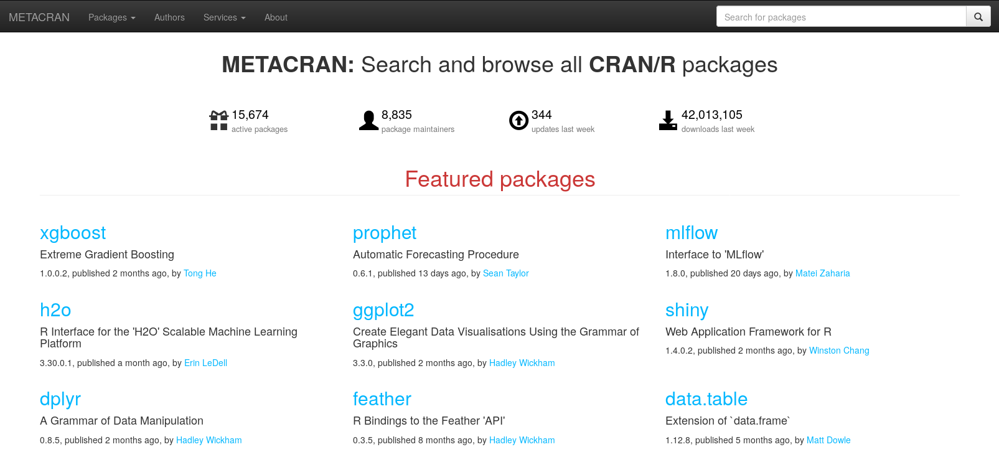
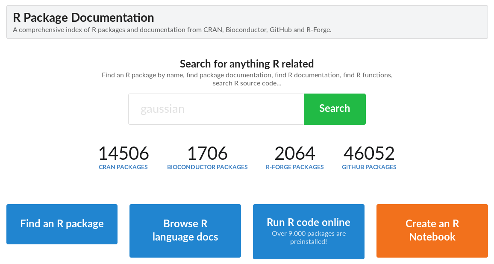
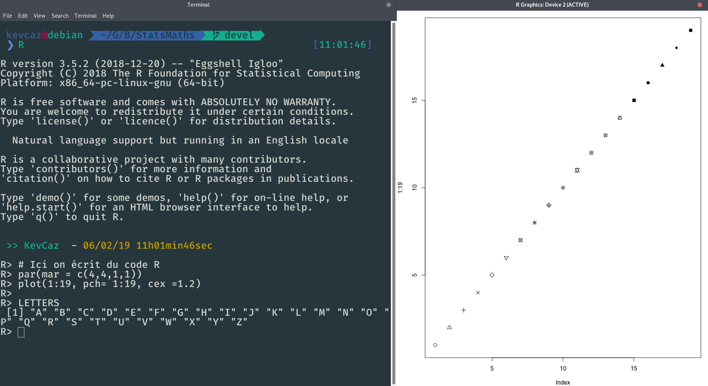
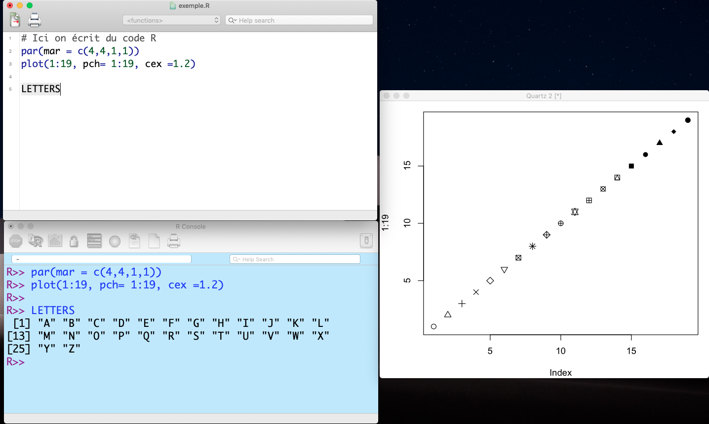
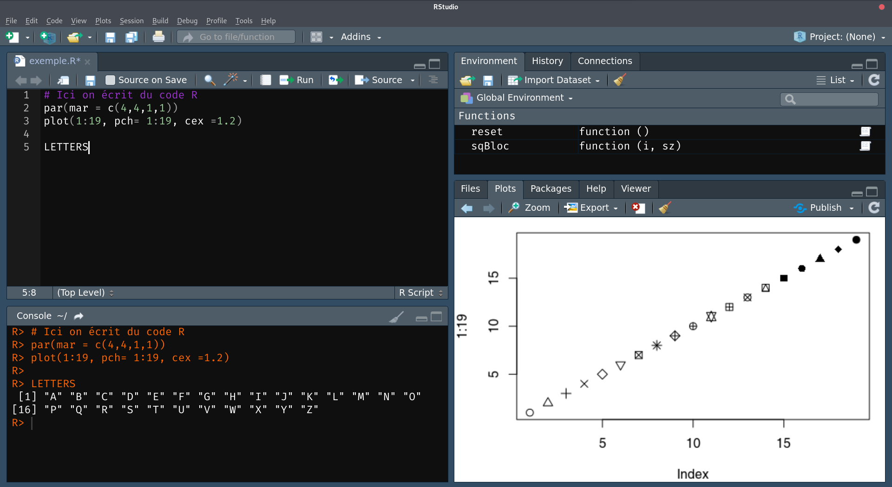
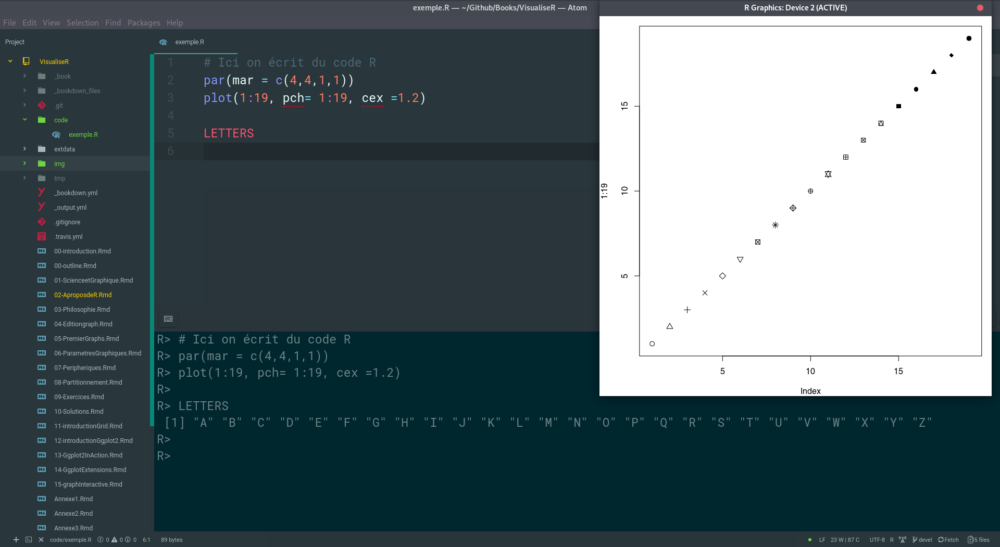

# À propos de R


Étant donné l’engouement autour de R depuis les 10 dernières années, on oublie
que le début de l'histoire remonte au années 70. Dans ce chapitre, nous revenons
sur la naissance et le développement de R: de S depuis les années 70 jusqu'à la
fin des années 90. Nous décrivons ensuite l'émergence de R et la relation qu'il
existe entre S et R. Dans la deuxième partie de ce chapitre, nous dressons un
portait de R en 2019.


## De S à R - 50 ans d'histoire

La description qui suit est une synthèse des trois documents suivants:

- Un article d'un des principaux contributeurs de Richard A. Becker [@becker_brief_1994]
- Le chapitre 2 du dernier livre de John M. Chambers, l'un des
principaux contributeurs de S et maintenant contributeur de R [@chambers_extending_2016]
- Le document *R genesis* par Ross Ihaka, l'un des auteurs de R disponible en ligne https://cran.r-project.org/doc/html/interface98-paper/paper_1.html consulté le 7 février 2019.


### Le langage S

Pour bien comprendre l'émergence de R, nous revenons sur le contexte dans lequel le langage S a vu le jour et comprendre ce que R lui doit. S est le produit du travail de chercheurs qui
en quête d'un outil performant pour la recherche en statistique dans un monde où l'informatique était en pleine effervescence.

Le résumé que nous faisons de cette émergence débute en 1976, à Murray Hill dans
le New-Jersey (États-Unis), au département de recherche en statistique
informatique des laboratoires Bell[^noteS1], les calculs sont alors réalisés à
l'aide d'une bibliothèque FORTRAN[^noteS2] SCS (_Statistical Computing
Subroutines_). Un des problèmes posés par cet outil était le temps passé à gérer
les entrées et les sortis au programme qui était long même pour des calculs
simples (une régression linéaire par exemple). Suite à ce constat, les
chercheurs John Chambers, Richard Becker, Doug Dunn et Paul Tukey, décidèrent de
construire un environnement interactif et un nouveau langage afin de faciliter
leur recherche[^noteS3]. Ce nouveau programme informatique faciliterait
l'utilisation des la bibliothèque SCS grâce à un ensemble d'objets et de
fonctions manipulés à l'aide d'une syntaxe intuitive et permettrait une
exploration visuelle des données à l'aide d'un outil graphique performant.

<!-- Tukey Exploratory Data Analysis-->

Suite aux efforts de ces chercheurs, la première version de S (version 1.0) vu le jour en janvier 1977 et fut diffusée au sein des laboratoires Bell. Ainsi, se
constitua la toute première communauté d'utilisateurs de S, celles des chercheurs des laboratoires Bell, communauté restreinte mais très active. La première version de S reflète les avancements en statistique informatique fait depuis les années 50 et met en application les principes que John Chambers développe en 1977 [@chambers_computational_1977] :

  1. stockage, manipulation des données avant traitement (les trier par exemple);
  2. utiliser des algorithms efficaces pour traiter les données;
  3. visualiser les données avec des bibliothèques adéquates.

L'objet de base de S était alors le vecteur (de nombres, de caractères ou bien de variables booléennes), ce qui reste valable avec R aujourd'hui. Une matrice
était aussi un vecteur mais avec un vecteur auxiliaire `Dim` (ces vecteurs
auxiliaires deviendront plus tard les attributs accessible avec la fonction
`attributes` dans R). Cette version offrait également la possibilité de créer
des structures dont les différentes composantes étaient appelées grâce à
l'opérateur `$` (abondamment utilisé par tous les utilisateurs de R
aujourd'hui, /de même que la fonction `str` pour avoir un aperçu de l'organisation d'un objet dans R). Ces données étant facilement manipulable via un opérateur d'accès aux différents éléments `[]` (subscripting operator) et permet, entre autre, de sous-échantillonner les éléments à partir d'une variable booléenne (ce que les utilisateurs de R font très souvent). Enfin, les graphiques, sujet de ce livre, étaient réalisés grâce à un ensemble de fonctions implémentées dans une bibliothèque distincte appelée GR-Z dont les fonctionnalités sont encore aujourd'hui présentes dans le package R `graphics`.


L'année suivante, la version 2.0 introduisit notamment les objets de type `list` pour inclure une collection d'autre objets, amenant ainsi un nouveau type de relation entre les objets. En 1978, les progrès du langage de programmation C, développé dans le même bâtiment aux laboratoires Bell, donnèrent un nouvel élan au langage S. Ce langage développé par Dennis Ritchie et Ken Thompson à la fin des années 60 a été conçu pour être puissant, flexible et
portable, c'est notamment le langage dans lequel est écrit le kernel Linux qui
est un peu partout aujourd'hui[^noteC]. La portabilité de C, c'est-à-dire le fait qu'il soit utilisable sur un très grand nombre d'ordinateurs d'architectures différentes, décida les créateurs du langage S (dont les bureaux étaient voisins de celui de Ritchie) d'opter pour une utilisation du langage C et du système UNIX. C'est ainsi qu'en octobre 1979, une version UNIX fut implémentée et devint la version de développement du langage S. R est lui
même écrit en C.

La suite du développement du langage est liée aux retours des premiers utilisateurs de S.
Ces derniers étaient assez limités dans les tâches qu'ils pouvaient accomplir avec S.
Afin d'augmenter les possibilités offertes à l'utilisateur, une boucle `for` très flexible fut introduite, dont la syntaxe a été conservé par R : `for (i in index) expression`.
De même, une fonction `apply()` fut ajoutée pour répéter une opération donnée sur chaque colonne ou chaque ligne d'une matrice. Il apparut également une interface de langage pour créer des macros[^noteS4]. Toutes ces innovations sont contenues dans la version de 1984 décrite dans un livre surnommé le _Brown Book_[^noteS5]: _S: An Interactive Environment for Data Analysis and Graphics_ [@becker_s_1984]. L'année suivante, le livre _Extending the S system_ [@becker_extending_1985] décrit comment ajouter de nouvelles fonctions au langage S. C'est au même moment que le code source du langage S fut largement distribué sous licence commerciale et éducationnelle.


### Le « new S »

Durant la période 1984--1988, S fut profondément transformé. Alors qu'il était à l'origine dédié à la recherche en statistique, S avait, de fait, de grandes capacités pour manipuler des données, les analyser et les visualiser. Un projet mené par John Chambers fut dédié à l'exploitation de ces atouts pour produire un langage de programmation générale dédié au traitement des données (le _Quantitative Programming Environment_, QPE). En 1986, suite aux avancés du projet, il se posa la question de savoir comment articuler S et QPE. De cette interrogation naquit une troisième version du langage S décrite dans le _Blue Book_: _The New S Language: A Programming Environment for Data Analysis and Graphics_ [@becker_new_1988]. Les changements apportés étaient d'une telle ampleur qu'il fallut changé le nom : S devint le new S. Beaucoup de fonctions furent réécrites en C. Ainsi, la part de FORTRAN diminua au profit de C pour améliorer la portabilité du new S. A cela s'ajouta la fin de l'interface de langage au profit d'un ensemble très cohérent pour les fonctions. Toutes les fonctions devinrent des objets et les utilisateurs purent alors créer leurs propres fonctions avec la syntaxe que nous connaissons aujourd'hui dans R. Ces fonctions pouvaient avoir un nombre non prédéfini d'arguments et certains de ces arguments pouvaient être passés à d'autres fonctions grâce à l'argument `...`. Les fonctions écrites en C ou FORTRAN pouvaient être incorporées au new S grâce à des fonctions particulières qui existent toujours dans R: `.C()`, `.Fortran()`, etc. Les fonctions graphiques furent également retravaillées et le new S apporta de nouvelles fonctionnalités pour profiter des environnements graphiques, notamment le _X Window System_ (X11), apparu en 1984.

En 1992, un nouveau livre, le _White Book_: _Statistical Models in S_ [@chambers_statistical_1993], développa les nouvelles fonctionnalités du new S pour travailler sur les modèles statistiques. Les objets de classe `data.frame` furent introduit : des matrices dont les colonnes peuvent contenir des objets de différentes natures (p. ex. numérique, texte, booléen, etc.). C'est un objet qui, à notre sense, est vraiment pertinent pour les statistics et sont utilisation est une des forces de R. Avec les `data.frames` sont introduits les objets de classe `formula` (caractérisés par l'opérateur `~`) qui permettent de décrire des modèles complexes en très peu de lignes de code. Enfin, la programmation orientée objet[^noteS6] prend une place plus importante (il y en avait des prémices en 1988 avec la notamment la fonction `print()`). Cette approche donne une cohérence et une certaine facilité d'utilisation au langage S et encore aujourd'hui au langage R : on peut ainsi afficher tous nos objets avec la fonction `print()` dont l'affichage dépendra du type de l'objet (leur classe) sans se poser de question. Le développement d'une approche orientée objet plus formelle est aussi le point central du dernier livre sur S, le *Green Book*: *Programming with Data: A guide to the S Language* qui formalise les objets dit S4 [@chambers_programming_1998].

La création du langage S a soulevé des enjeux techniques majeurs que les développeurs ont surmontés en piochant des idées tantôt dans d'autres langages (p. ex. l'opérateur assignment `<-` provient du langage Algol), tantôt en trouvant des solutions spécifiques à S (p. ex.  l'argument `...` de certaines fonctions). Le résultat de la vingtaine d'années de développement de S a produit un langage puissant pour la recherche en statistique mais plus généralement pour l'ensemble des opérations du traitement de données. C'est pour ces travaux que John Chambers fut récompensé en 1998 par le prix ACM (_Association for Computing Machinery_). Au début des années 1990, l'histoire de S se prolongea de deux manières: d'un coté la naissance du logiciel libre R et de l'autre, la création d'une version commercial baptisée S-PLUS proposée par l'entreprise américaine TIBCO, qui prit fin en 2009 quand l'entreprise, au vu de la popularité de R, opta pour le développement d'un outil basé sur R : TERR (_TIBCO Enterprise Runtime for R_)[^noteS7].


[^noteS1]: La lecture de la page Wikipédia dédiée au Laboratoires Bell permet de
se faire une idée de l'importance des Laboratoires Bell en terme d'innovation,
les laboratoires Google de l'époque (https://fr.wikipedia.org/wiki/Laboratoires_Bell, consulté le 31 janvier 2019).

[^noteS2]:FORmula TRANslator est un langage apparu en 1954 développé par
John Backus chez IBM (https://fr.wikipedia.org/wiki/Fortran, consulté le 31 janvier 2019).

[^noteS3]: *It was the realization that routine data analysis should not require writing Fortran programs that really got S going.* [@becker_s_1984 p. 2] "Our primary goal was to bring interactive computing to bear on statistics and data analysis problems."

[^noteS4]: Une macro est formée d'un identificateur et d'un morceau de code. Avant l'exécution du programme, toutes les occurrences de l'identificateur dans le code source seront remplacées par le morceau de code auquel elles sont associées.

[^noteS5]: Les livres décrivant le langage S sont nommés par des noms de couleurs, en rapport avec la couleur de leur couverture voir http://www.sumsar.net/blog/2014/11/tidbits-from-books-that-defined-s-and-r/
consulté le 31janvier 2018.

[^noteS6]: La programmation orientée objet définit des objets et des méthodes tout en permettant de faire un lien entre les deux. Par exemple, si des objets de classe _point_ et d'autres de classe _ligne_ sont définis, une méthode, c.-à-d. une fonction, _plot()_ peut ensuite être définie pour afficher ces deux objets dans un environnement graphique. La force de la programmation orientée objet sera de permettre un affichage adéquat : des points séparés à l'appel de la méthode _plot_ sur l'objet de classe _point_ (_plot(point)_) et des points reliés entre eux à l'appel de la méthode _plot_ sur l'objet de classe _ligne_ (_plot(ligne)_).

[^noteS7]: Voir https://en.wikipedia.org/wiki/S-PLUS, consulté le 7 février 2019.

[^noteC]: L'article de Wikipedia est un bon point de départ pour s'informer sur l'histoire de C: https://fr.wikipedia.org/wiki/C_(langage), consulté le 21 Décembre 2018.


### De S à R

Au milieu des années 1990, au département de statistiques de l'université d'Auckland, Ross Ihaka et Robert Gentleman font à un constat similaire à celui des chercheurs des Bell Labs firent des années plus tôt : le besoin d'un outil logiciel performant pour le domaine. Bien que les premières versions du langage S étaient facilement accessible aux milieux universitaires, l'outil n'était pas libre et difficile à mettre en place sur les machines Macintosh avec lesquelles ces chercheurs travaillaient. Les deux chercheurs se lancèrent alors dans le développement d'un nouvel outil inspirés par le new S mais aussi le Scheme[^naisR2] comme ils expliquent dans leur article de 1996 [@ihaka_r_1996]. Ainsi naquit le langage R, fortement influencé par le new S mais avec un soupçonné de quelque principe de Scheme, notamment pour la gestion de la mémoire et de la portée des variables. Il faut ajouter à ces changements, des travaux sur l'interface graphique avec l'implémentation des couleurs, la texture des lignes, la possibilité d'introduire des formules mathématiques sur un graphique et la mise en page des graphiques. Ces deux derniers éléments sont le fait des travaux de thèse de Paul Murrel qui a travaillé sur la gestion des graphiques sous R[^naisR3].

En août 1993, les auteurs annoncent la mise à disposition de leur travail R sur la liste de diffusion S-news. Comme il a été fait pour S, R a mis en place le moyen de s'enrichir  des retours des utilisateurs. L'un des utilisateurs  particulièrement actif, Martin Mächler de l'Eidgenössische Technische Hochschule Zürich (ETH Zürich)[^naisR5], devint un acteur important du projet et incita les chercheurs de Nouvelle-Zélande à rendre leur logiciel libre. C'est ainsi que R fut mis à disposition de tous sous la licence publique générale GNU-GPL dès 1995, d'où son surnom de _GNU S_. L'article de 1996 _R: A Language for Data Analysis and Graphics_ qui met au grand jour l'existence de R [@ihaka_r_1996]. Ces deux événements combinés donnent une impulsion forte au langage R. De fait, ces dispositions allaient accroître le nombre d'utilisateur, et la distribution et la communication allaient en être profondément changées. En mars 1996, Mächler créa la première liste de diffusion spécifique à R : R-tester, qui fut divisée en trois l'année suivante : R-announcement, R-help et R-devel. Pour organiser le développement de R, il devint pressant d'avoir un système d'archivage dédié à R. Ce fut Kurt Hornik de l'université Technique de Vienne[^naisR4] qui s'en chargea et mis au point un système qui évoluera pour donner le CRAN actuel. Le nombre de retours sur R devint tel que Ihaka, Gentleman et Mächler ne suffisaient plus pour assurer convenablement le développement du langage. Ils décidèrent alors de partager cette tâche avec Doug Bates, Peter Dalgaard, Kurt Hornik, Friedrich Leisch, Thomas Lumley, Paul Murrell, Heiner Schwarte et Luke Tierney : l'équipe de développement _R-Core_[^naisR6] se formait.

Une manière simple et efficace pour prendre conscience de l'évolution de R de 1997 à nos jours est de fouiller dans les archives du site internet du CRAN. Par exemple, dans le fichier _README_ de la version R.0.49, on peut lire qu'en avril 1997, une bonne partie des fonctions du _Blue book_ [@becker_new_1988] et du _White Book_ [@chambers_statistical_1993] étaient déjà implémentées. La reconnaissance formelle du groupe R-Core est présente dans la version R.0.60 de décembre 1997. L'implémentation d'une grande partie des fonctionnalités de S conduisit à la version 1.0.0 de R, le 29 février 2000. Pour l'anecdote, le premier CD-ROM fut donné à John Chambers qui avait rejoint l'équipe du R-Core en 1998. En janvier 2001, c'est la première version d'un journal dédié à R (alors appelé R news) qui fut publiée (voir https://www.r-project.org/doc/Rnews/Rnews_2001-1.pdf, consulté le 12 décembre 2018). En décembre 2001, avec la version 1.4, ce sont les objets S4 qui sont implémentés. Ces derniers étaient décrits dans le _Green Book_ [@chambers_programming_1998] et procurèrent à R un cadre beaucoup plus formel pour faire de la programmation orientée objet. En octobre 2004, la version 2.0 était distribuée, et introduit pour la première fois le *lazy loading* (chargement paresseux) permettant d'améliorer les performances de  R: lorsqu'un package (extension) est chargé, il est rare que toutes ses fonctionnalités soient exploitées en même temps, R crée des bases de données pour stocker et répertorier le code qui ne sera alors chargé qu'au premier appel de l'utilisateur. En avril 2013, la gestion des valeurs d'indexation des vecteurs supérieurs à 2^31^ pour les systèmes exploitant des processeurs à 64 bits augmenta les performances de R en termes de mémoire et nous amena aux versions 3.x.x. Pour les lecteurs qui cherchent à obtenir des détails techniques relatifs aux fonctionnements internes de R, il est à noter qu'une documentation couvrant ces aspects est disponible en ligne https://cran.r-project.org/doc/manuals/r-release/R-ints.html (consulté le 21 décembre 2018). De plus, l’ensemble des changements associés aux différentes versions de R depuis Juin 2009 sont rapportés dans les différent numéros du *R Journal* dont les numéros sont visibles en ligne à l'adresse suivante https://journal.r-project.org/ (consulté le 21 décembre 2018) et il est possible de remonté jusqu'en 2001 en consultant les différents numéros de *R News* disponible à https://journal.r-project.org/archive/r-news.html
(consulté le 21 décembre 2018).


|Version     | Date de publication| Notes                                      |
|:-----------|:-------------------|:-------------------------------------------|
|R-0.49      | 23 avril 1997      | première version accessible sur le CRAN    |
|R-1.0.0     | 29 février 2000    | pour l'année millénaire et donc bissextile |
|R-1.2.1     | 22 juin 2001       | premier volume de R news                   |
|R-2.0.0     | 4 octobre 2004     | introduit le *lazy loading*                |
|R-3.0.0     | 3 avril 2013       | optimization pour les processeurs à 64 bits|
|R-3.5.0     | 23 avril 2018      | tous les packages sont                     |
|R-4.0.0     | 24 avril 2020      | pour les 20 ans de R                       |
|R-4.0.0     | 24 avril 2020      | version utilisée pour ce livre             |
: Date de sortie des différentes version sur le CRAN (voir https://cran.r-project.org/ pour une list complète).


[^naisR3]: Il est notamment l'auteur de l'ouvrage _R graphics_[ref].

[^naisR2]: Scheme est apparu dans les années 1970 au Massachusetts Institute of Technology (MIT) grâce au travail de Guy Lewis Steel et Geral Jay Sussman.

[^naisR4]: https://stat.ethz.ch/mailman/listinfo

[^naisR5]: Avec Friedrich Leisch, de la même institution, ils s'étaient rapprochés du projet en apportant des corrections à des bugs.

[^naisR6]: Ils étaient 11 initialement, 16 en 2002 et 21 en août 2015.


## R aujourd'hui


### Mais R c'est quoi au juste?

Les premières phrases de l'article en français consacré à R sur Wikipedia définissent R ainsi:

> R est un langage de programmation et un logiciel libre destiné aux statistiques et à la science des données soutenu par la R Foundation for Statistical Computing. R fait partie de la liste des paquets GNU3 et est écrit en C (langage), Fortran et R.[^noteR7]

[^noteR7]: https://fr.wikipedia.org/wiki/R_(langage) consulté le 22 décembre 2018.

De même sur la page du projet R, on peut lire:

> R is a free software environment for statistical computing and graphics. It compiles and runs on a wide variety of UNIX platforms, Windows and MacOS.[^noteR8]

> [Traduction] R est un environment logiciel pour la statistique computationnelle et les graphiques. Il peut être compilé et exécuté sur un grand nombre de plateforme UNIX, Windows et MacOS.

[^noteR8]: https://fr.wikipedia.org/wiki/R_(langage) consulté le 22 décembre 2018.

R est donc un langage: permet d'écrire du code (*en* R) mais aussi en logiciel qui permet d'exécuter du code R (*dans* R) pour faire des statistiques et des graphiques.
R est un langage dit interprété.



Par opposition à un langage compilé comme C (le langage dans lequel R est écrit).



Concrètement R est un ensemble de fichiers. Dans la version 3.5.2, il y, entre autre, 559 fichiers `.c`, 289 fichiers `.po` (pour la traduction en différente langues), 196 fichiers `.h` (headers utilisé avec C), 86 fichiers `.f` (FORTRAN) et 2346 fichiers `.R`. À l'installation de R, tous ces fichiers sont compilés de sorte que vous pouvez utiliser R dans un terminal.



Un terminal avec R permet d'utiliser toutes les fonctionnalités de R mais n'est suffisant pour programmer de manière efficace. C'est pourquoi on utilise une interface de développement, R propose une telle interface mais la plus populaire de nos jours est RStudio[^noteRStud], nous y reviendrons.

[^noteRStud]: https://www.rstudio.com/products/rstudio/download/ consulté le 24 décembre 2018.


### Un ensemble d'acteurs

Il y a aujourd'hui une myriade d'acteurs qui gravitent autour de R de sorte qu'il est difficile de s'y retrouver et de comprendre qui fait quoi. Ce qui suit est une tentative de mettre un peu d'ordre dans toutes ces informations.


#### La R fondation et la *R Development Core Team*

Le plus simple pour se repérer est de consulter sur la page du projet R: https://www.r-project.org/ (consulté le 23 décembre 2018). Sur cette page, on trouve notamment un lien vers la Fondation R[^noteProj]. Il s'agit d'une organization a but non lucratif qui a été créé par les membres de la *R Development Core Team* pour pérenniser le développement de R et c'est finalement une distinction. Les membres de la fondation sont des personnes reconnus pour les efforts dans le développement de R, c'est une distinction honorifique. Quand aux membres de la *R Development Core Team*, ce sont les développeurs qui ont un accès d'écriture au code source de R. Ce sont les premiers membres listés quand vous tapez `contributors()` dans une console R. Ils fixent les bogues dans les fonctionnalités de base de R[^noteR9] et rendent disponibles les nouvelles versions de R sur le CRAN.

[^noteProj]: https://www.r-project.org/foundation/ consulté le 23 décembre 2018


#### Le CRAN

Toujours sur la page du projet R, il y a un lien vers le CRAN (*Comprehensive R Archive Network*) qui est le site Internet où sont archivées les différentes versions de R ainsi que les packages qui ont été soumis au CRAN et qui ont été acceptés. C'est également une source privilégiée de resources avec de nombreux manuels et ouvrages pour se familiariser avec R (voir les sections *Manuals* et *Contributed* sur https://cran.r-project.org/). Le CRAN est maintenu par une équipe de volontaires, la "CRAN team", qui met à jour le site et s'occupent des soumissions des packages. Pour être plus exact, le CRAN est une collection de sites miroirs dont les contenus sont synchronisés avec le site du CRAN maintenu à la Wirtschaftsuniversität à Vienne. En 2002, il existait 12 sites miroirs, et en
décembre 2018, 164 sites miroirs se répartissent les téléchargements de R et de ses packages, ainsi que l'archivage des différentes versions. Comment avoir accès à ces chiffres? Avec R bien sur:

```R
# lit le code source de la page qui référence les miroirs
mir <- readLines("https://cran.r-project.org/mirrors.html")
# compte le nombre de ligne qui contiennent des liens internet avec
# http dans le lien (il y a d'autres liens sur la page mais sans http)
sum(
  unlist(
    lapply(mir, grepl, pattern = "<a href=\"http")
  )
)
```

[^noteR9]: Les bogues peuvent être rapportés par les utilisateurs sur bugzilla https://bugs.r-project.org/bugzilla3/.


#### Le consortium R

Une autre entité qui a vu le jour récemment est le consortium R :
https://www.r-consortium.org/ (consulté le 24 décembre 2018). Comme indiqué
par le site Internet dédié

> The central mission of the R Consortium is to work with and provide support to the R Foundation and to the key organizations developing, maintaining, distributing and using R software through the identification, development and implementation of infrastructure projects.

> [Traduction] La mission centrale du consortium R est de collaborer avec la Fondation R et les organisation majeures qui développent, maintiennent, distribuent et utilisent le logiciel R à travers l'identification,. le development et l’implémentation de projet infrastructure.

Ce projet est l'un des projets Open Source supporté par la Fondation Linux:  https://www.linuxfoundation.org/projects/ (consulté le 22 décembre 2018). Pour
voir les soutiens financiers du consortium R rendez vous sur cette page https://www.r-consortium.org/members.


#### RStudio

Il s'agit d'un acteur tellement connu qu'il y a une parfois une confusion
entre R et RStudio. RStudio, Inc.[^noteRStudio] une entreprise fondé par Joseph J. Allaire qui développe un environment de développement[^noteRStudio2] pour R et propose des services aux entreprises basés sur R (voir la section *Products* sur leur site Internet). En décembre 2018, RStudio comptait près d'une centaine de salariés https://www.rstudio.com/about/ dont de nombreux programmeurs parmi les plus actifs au sein de la communauté des utilisateurs de R (Hadley Wickham et Yihui Xie par exemple). RStudio est connu pour son interface de développement du même nom et pour la qualité des packages R que les salariés de RStudio développements. C'est un modèle économique classique dans le monde de l’opensource[^noteRStudio3]: une entreprise propose des services autour d'un logiciel qu'elle contribue activement à améliorer et dont elle fait une promotion active (étant donné que c'est la qualité du logiciel qui va déterminer son nombre de clients). La contribution de RStudio à R est considérable, les packages qu'elles contribuent à développer son parmi les plus utilisés[^noteRStudio4].

[^noteRStudio]: https://www.rstudio.com/ consulté le 24 décembre 2018.
[^noteRStudio2]: https://fr.wikipedia.org/wiki/Environnement_de_d%C3%A9veloppement consulté le 24 décembre 2018.
[^noteRStudio3]: https://medium.com/france/business-model-de-l-open-source-a2d8e53181f7 consulté le 24 décembre 2018
[^noteRStudio4]: voir le compte GitHub de RStudio https://github.com/rstudio (consulté le 24 décembre 2018)


#### rOpenSci

Sur le site Internet de rOpenSci[^noterOpen], on peut lire:

> rOpenSci fosters a culture that values open and reproducible research using shared data and reusable software.

> [Traduction] rOpenSci encourage une culture qui promeut la recherche ouverte et reproductible qui utilise des données partagées et des logiciels réutilisables.

Pour cela l'équipe de rOpenSci crée et révise des packages[^noterOpen2] qui facilitent la recherche ouverte et reproductible. Il peut s'agir de packages qui interrogent des bases de données accessibles en ligne via des interfaces spécifiques, un exemple emblématique de cette catégorie est `taxize`[^noterOpen2b], véritable couteau suisse pour obtenir des informations taxonomiques
ou encore de packages qui améliore le flux de travail comme `drake`[^noterOpen2a]. rOpenSci anime également un blog[^noterOpen3] sur lequel on trouve des posts présentant les différents packages révisés par cette organisation et des tutoriels pour apprendre à réaliser certaines manipulations de données avec R. Enfin, rOpenSci anime une communauté[^noterOpen4] dynamique et propose des *community calls*, c'est-à-dire des présentations sur certains aspects de R que l'on peut joindre en direct ou consulté l'archive associée[^noterOpen5].


[^noterOpen]: https://ropensci.org/about/ consulté le 26 décembre 2018 ou on apprend aussi que que rOpenSci est sponsorisé par NUMFOCUS  (https://numfocus.org/).
[^noterOpen2a]: https://github.com/ropensci/drake consulté le 26 décembre 2018.
[^noterOpen2b]: voir https://github.com/ropensci/taxize et https://ropensci.org/tutorials/taxize_tutorial/ consultés le 26 décembre 2018.
[^noterOpen2]: https://ropensci.org/packages/ consulté le 26 décembre 2018.
[^noterOpen3]: https://ropensci.org/blog/ consulté le 26 décembre 2018.
[^noterOpen4]: https://ropensci.org/community/ consulté le 26 décembre 2018.
[^noterOpen5]: https://ropensci.org/commcalls/ consulté le 4 janvier 2019.


#### La communauté des utilisateurs de R

La myriade des utilisateurs de R est sans aucun doute l'acteur le plus important
car cette communauté :

1. augmente les fonctionnalités de R en créant des packages;
2. échanges des informations relative à R par la création et l'édition de manuels, de livres, de blogs, etc.;
3. s'auto-organize à travers des communautés locales d'utilisateurs;
4. s'auto-supporte: les utilisateurs répondent rapidement aux questions d'autres utilisateurs.

Tout le monde peut écrire des packages ou partager son expérience avec R et de fait, beaucoup d'utilisateurs le font. Il existe un grand nombre de bloggers qui produisent une multitude de posts sur différents aspects de R[^noteCom]. C'est une resource riche et diversifiée et il existe une plateforme très utile qui les rassemble[^noteCom1]: R-bloggers[^noteCom2]. De nombreux indices attestent que la communauté des utilisateurs de R est en croissance. Par exemple, le nombre de groupes d'utilisateurs de R est en très forte hausse comme le montre la couverture du dernier livre de John Chambers qui compare le nombre de groupe d’utilisateurs de R entre 2010 et 2015.

![Couverture de *Extending R* [@chambers_extending_2016]. Pour une liste qui recense ces communautés, voir https://jumpingrivers.github.io/meetingsR/index.html (consulté le 26 décembre 2018)](img/chap2/extendingR.jpg)

On peut aussi regarder la croissance du nombre de packages qui dépassait 10,000 en 2016 (voir https://blog.revolutionanalytics.com/2017/01/cran-10000.html consulté le 26 décembre 2018). L'explosion du nombre de packages R hébergés sur GitHub[^noteCom3] (près de
45000 à la fin décembre 2018 d'après https://rdrr.io/). Un autre indice est la popularité du tag "R" sur la plateforme d'échange *stack overflow* où les utilisateurs posent des questions auxquelles répondent d'autres utilisateurs. C'est d’ailleurs la popularité sur Github et sur stack overflow que le site internet [redmonk](https://redmonk.com/) évaluent la popularité des langage de programmation et en janvier 2018, R était classé 12^ème^.



Un dernier indice de l'accroissement de la popularité de R chez les écologistes que nous sommes est la forte demande en formation de nos collègues. R figure incontestablement parmi les outils computationnels les plus utilisés pour la statistique et la science des données de manière générale. De plus en plus d'écologues apprennent R avec un niveau de formation de de plus en plus avancé.


[^noteCom]: Nous avons notre propre blog qui traite souvent de R https://insileco.github.io/.
[^noteCom1]: https://blog.feedspot.com/r_programming_blogs/ pour une classification subjective.
[^noteCom2]: https://www.r-bloggers.com/ consulté le 26 décembre 2018.
[^noteCom3]: un site Internet qui peut être décrit comme une forge logiciel basée sur le logiciel `git` qui rend la programmation collaborative particulièrement efficace.


### Une documentation abondante et facilement accessible

Les acteurs mentionnés ci-dessus précédemment produisent une documentation
abondante aussi bien pour débuter avec R, réaliser des tâches spécifiques avec R (au moyen de packages dédiés) que pour programmer efficacement avec R et développer ses propres packages[^noteDoc].

Pour les débutants, un moyen rapide de mettre le pied à l'étrier est de consulter les sections *Manuals*, *Books* de la page Internet du projet R (https://www.r-project.org) et la section *Contributed* qui propose des introductions à R dans différentes langues. Cette page n'est malheureusement plus mise à jour mais on y trouve, par exemple, l'*Introduction à R* de Julien Barnier (voir http://alea.fr.eu.org/pages/intro-R). On peut aussi citer des des acteurs de formation très populaires qui offrent des formations dédiés à R. On peut citer la formation d'introduction à R de DataCamp (en anglais, https://www.datacamp.com/courses/free-introduction-to-r, consulté le 28 décembre 2018) mais aussi celle de OpenClassrooms (en français, malgré le nom,
 https://openclassrooms.com/fr/courses/1393696-effectuez-vos-etudes-statistiques-avec-r, consulté le 28 décembre 2018).

De la documentation en ligne, gratuite et de qualité est aussi disponible pour se former à des tâches plus spécifiques. Le site bookdown.org[^noteDoc2] propose des livres disponibles, par exemple *Advanced R* de Hadley Wickham y est répertorié (voir https://adv-r.hadley.nz/). Notons que RStudio référence aussi certains ouvrage de leur membre https://www.rstudio.com/resources/training/books/. Le site RStudio propose aussi des *cheatsheet* (des fiches récapitulatives, voir https://www.rstudio.com/resources/cheatsheets/). A cela, il faut ajouter la longue listes des post de différents blogues et les réponses aux questions sur les forums[^noteFor]
sur *stack overflow*.

Les utilisateurs anglophones ont facilement accès à une masse considérable d'informations grâce à différents ouvrages, notamment ceux regroupés dans la collection _Use R!_, publiée par le groupe éditorial Springer[^noteDoc3] et éditée par R. Gentleman, K. Hornik Kurt et G. Parmigiani. Il y a aussi un certain nombre d'ouvrage publié chez CRC Press[^noteDoc4] and chez O'Reilly Media[^noteDoc5]. Des ouvrages en français sont également disponible mais en nombre plus restreint. Gaël Millot a ainsi écrit un ouvrage très complet (plus de 800 pages dans la troisième édition), *Comprendre et réaliser les tests statistiques à l'aide de R* édité chez de Boeck [@millot_comprendre_2018]. Springer a édité durant un temps des ouvrages dans la série _Pratique R_. Il existe aussi trois ouvrages qui abordent la statistique avec R aux Presses Universitaires de Rennes et  _R et espace_ édité chez Framabook [@groupe_elementr_r_2014].

_The R journal_, que nous avons mentionnés plus haut[^noteDoc6], est une revue bisannuelle dédiée à l'actualité de R. Un numéro est un ensemble d'articles qui présentent les possibilités offertes par certains packages ou qui propose une synthèse des différentes packages sur un thème précis. On y trouve également un rapport exhaustif détaillant les modifications apportées aux nouvelles versions de R ainsi que les changements sur le CRAN.

L'ensemble des listes de diffusion relatives à R est aussi une mine d'information. En 1997, il y avait trois listes de diffusion : _R-announcement_ pour annoncer les nouveautés de R, _R-help_ dédiée à l’entraide entre utilisateurs R et _R-devel_ pour les développeurs. Depuis, ont été ajoutées les listes _R-package-devel_, pour les développeurs de packages et _R-packages_ pour annoncer la sortie de nouveaux packages. À côté de ces listes principales, on trouve également pas moins de 20 autres listes de diffusion couvrant les différentes utilisations de R : les listes _R-SIG_ (_Special Interest Group_) qui traitent aussi bien de la manipulation des données spatiales que de l'écologie ou encore de la finance (https://www.r-project.org/mail.html consulté le 28 janvier 2018).

Utiliser Twitter est une manière efficace de découvrir les possibilités qu'offrent R et de trouver de nouvelles resources. Les tweets relatifs à R contiennent généralement le hashtag **#rstats**. Il y a de nombreux membres actifs de la communauté R qui partagent quotidiennement des informations. Voici quelques comptes twitter avec des informations et des astuces bien utiles :

- &#64;\_R\_Foundation tweets de la fondation R;
- &#64;RConsortium tweets du consortium R;
- &#64;rstudio compte principal de RStudio;
- &#64;rOpenSci tweets de rOpenSci;
- &#64;RLangPackage tweet à propos de 1 package par jour;
- &#64;CRANberriesFeed un compte qui rapporte les mise à jour de packages;
- &#64;RLangTip donne des astuces quotidiennement;
- &#64;daily\_r\_sheets tweet une fiche récapitulative sur un package par jour
- &#64;dataandme compte de Mara Averick, employée apr RStudio, qui partage de nombreuses resources.

Enfin, une autre manière d'enrichir ses connaissances relatives à R est de participer à l'une des conférences et autre rencontre sur R où se retrouvent les différents acteurs. La R foundation soutient activement deux conférences *Use R!* et *DSC* (Directions in Statistical Computing)[^noteDoc7]. La première est présentée comme un forum pour la communauté des utilisateurs de R et la seconde est orientée sur la recherche en statistique computationnelle et donc ne concerne pas exclusivement R et est plutôt destinée à un public de chercheurs. A ces deux conférences, il faut ajouter deux autres rencontres annuelles: la *rstudio::conf* de RStudio[^noteDoc8], et la *unconference* (littéralement la non conférence) rOpenSci[^noteDoc8a]. Enfin, il y a des conférences qui à l’initiative de de membres actifs de la communauté R comme par exemple *R à Québec*[^noteDoc9] et aussi de nombreuses rencontres de groupe d'utilisateurs [^noteDoc10].


[^noteDoc]: nous maintenons une liste de resource à l'adresse suivante: https://insileco.github.io/wiki/usefulr/.
[^noteDoc2]: https://bookdown.org/ consulté le 28 décembre 2018.
[^noteDoc3]: https://www.springer.com/series/6991 consulté le 28 janvier 2019.
[^noteDoc4]: https://www.crcpress.com/ consulté le 28 janvier 2019.
[^noteDoc5]: https://www.safaribooksonline.com/library/publisher/oreilly-media-inc/ consulté le 28 janvier 2019.
[^noteDoc6]: https://journal.r-project.org/ consulté le 30 janvier 2019.
[^noteDoc7]: https://www.r-project.org/conferences.html consulté le 30 janvier 2019.
[^noteDoc8]: https://www.rstudio.com/conference/ consulté le 30 janvier 2019.
[^noteDoc8a]: http://unconf18.ropensci.org/ consulté le 31 janvier 2019.
[^noteDoc9]: http://raquebec.ulaval.ca/2019/ consulté le 30 janvier 2019.
[^noteDoc10]: Voir https://jumpingrivers.github.io/meetingsR/index.html, consulté le 31 janvier 2019.

[^noteFor]: Tel que celui maintenu par le Centre de coopération internationale en recherche agronomique pour le développement (CIRAD) http://forums.cirad.fr/logiciel-R/index.phpm
consulté le 28 janvier 2019.


### Les packages

Un package (ou librairie) est un ensemble de fichiers que l'on ajoute à R pour en
étendre les fonctionnalités. Quand on installe R, par défaut, on installe l'ensemble des fichiers qui permettent d'écrire en R et d'interagir avec, mais également des fonctionnalités de base regroupées en deux ensembles de packages: 15 packages dits de base (p. ex. le package package `graphics`) et 15 packages recommandés (dont le package `nlme` qui permet de faire des modèles mixtes)[^notePkg1]. L'utilisateur peut par la suite ajouter des fonctionnalités supplémentaires pour étendre les possibilités offertes par R en téléchargeant depuis un server qui héberge des packages R, par exemple depuis le CRAN.

Un package valide est un ensemble de fichiers structuré et qui passe a un certain nombre de tests[^notePkg2]. En général, un package regroupe un ensemble de fonctions réunies sous une même thématique. Par exemple, on trouvera des packages pour faire des modèles mixtes, de la géostatistique, des graphiques, etc. Les packages _jpeg_ et _png_ proposés par Simon Urbanek sont chacun composé de deux fonctions permettant d'importer et d'exporter des fichiers au format jpeg et png. Le package _plotrix_, maintenu par Jim Lemon, est une collection d'environ 160 fonctions (dans sa version 3.7-4) qui étendent les fonctionnalités graphiques du package _graphics_. Le package _ggplot2_, maintenu par Hadley Wickham, est une implémentation de _La Grammaire des Graphiques_ développée par Leland Wilkinson. Ce package est d'une certaine manière plus qu'une simple collection de fonctions, il développe des outils et des méthodes qui changent profondément l'approche de la création de graphique et d'ailleurs de nombreux packages l'utilisent pour ajouter de nouveaux types graphiques. Comment trouver un package sur le CRAN ? En générale c'est en lisant des articles ou des livres sur R qu'on apprend l'existence de tel ou tel packages. Cela étant dit, sur le CRAN sont disponibles des *task view* (https://cran.r-project.org/web/views/ consulté le 5 février 2018) qui dresse un paysage des packages disponibles pour un thème donné[^notePkg3]. Il existe aussi des initiatives individuelles sur GitHub qui rassemblent et classifient une grande quantité de packages sous forme de listes[^notePkg4]. Enfin, il y a le site [METACRAN](https://www.r-pkg.org/) qui permet une recherche efficace parmi les packages disponible sur le CRAN.





Combien de packages existent-t-il actuellement ? Dans le numéro de décembre 2009 du _The R journal_, John Fox relate la croissance exponentielle du nombre de packages R [@fox_aspects_2009]. D'une centaine de packages au début des années 2000, on arrive à plus de 7000 en août 2015; la barre des 10000 packages a été franchie en 2017 et en février 2019, plus de 13600 packages sont disponibles sur le CRAN[^notePkg5].


À ce nombre de packages viennent s'ajouter près de 1700 packages disponibles sur [Bioconductor](https://www.bioconductor.org/) et des dizaines de milliers disponibles
sur différentes forges logiciel : [R-forge](https://r-forge.r-project.org/), [omegahat](http://www.omegahat.net/), [GitHub](https://github.com/), [bitbucket](https://bitbucket.org/). Le site [R Package Documentation](https://rdrr.io/) rassemble la documentation des packages disponibles sous différentes plateformes.




Comme le soulignait déjà Kurt Hortnik en 2009 [@hornik_are_2012], cette abondance de packages pose un certain nombre de questions relatives à la facilité de trouver la fonctionnalité désirée, la redondance des fonctions et la qualité du code. Les tests auxquels sont soumis les packages soumis au CRAN ne couvrent pas complètement ces deux derniers aspects. Selon Kurt Hortnik, en dépit des défis posés par le nombre croissant de packages développés, une politique plus contraignante n'est pas souhaitable, et quand bien même celle-ci serait mise en place, elle n'affecterait pas tant la courbe de croissance. À son avis, il faudrait repenser les relations entre les packages afin de diminuer la similarité entre les packages au profit d'interdépendances. Une première mesure pour maintenir une augmentation de la qualité des packages sur le CRAN est de permettre au utilisateur de donner un retour de leur utilisation (rapporté des bogues notamment). Les forges logiciel telles que _Github_, *Bitbucket* ou *R-Forge* sont fait pour cela et leur utilisation est de plus en plus fréquente. Une autre mesure est d'inciter les créateurs de packages à faire évaluer leur travail par les pairs, en soumettant leur package à des journaux/organisations spécialisée comme *Journal of Open Source Software* ou rOpenSci (voir plus haut).


[^notePkg1]: Voir https://stackoverflow.com/questions/9700799 et  https://cran.r-project.org/src/contrib/3.5.2/Recommended/ consultés le 31 janvier 2019.

[^notePkg2]: Pour les détails techniques voir *Writing R extensions* https://cran.r-project.org/doc/manuals/r-release/R-exts.html, consulté le 31 janvier 2018.

[^notePkg3]: Le package [ctv](https://cran.r-project.org/web/packages/ctv/) permet d'installer tous packages d'un thème particulier.

[^notePkg4]: voir par exemple https://github.com/qinwf/awesome-R, consulté le 7 février 2019.

[^notePkg5]: Le nombre exact est indiqué en haut de la page https://cran.r-project.org/web/packages/ consulté le 5 février.


### Les interfaces utilisateurs

Travailler avec R, c'est écrire des lignes de code dans le langage R qui sont interprétées par R et pour cela, l'utilisateur utilise le programme R qui peut être ouvert de différentes manière. Par exemple en tapant `R` dans un émulateur de Terminal[^noteInter].




À chaque utilisation de R, l'utilisateur écrit une suite plus ou moins longue de commandes et utiliser simplement la console pour travailler son code est finalement assez peu efficace. C'est pour cela qu'on a recourt à un éditeur de code avec lequel l'utilisateur crée des fichier `.R` dans lequel il rédige les suites de commandes qu'il envoie vers la console R. Donc, ce qu'il fait pour travailler efficacement avec R c'est une console R et un éditeur de code. Il existe des logiciels qui offrent les deux fonctionnalités. Par exemple, lorsque R est téléchargé depuis le CRAN, il est fournit avec une interface utilisateur assez minimaliste avec laquelle l'utilisateur peut facilement créer des scripts et et une console R est ouverte à l'ouverture du logiciel.




Comme nous l'avons mentionné précédemment, une des interfaces utilisateurs les plus utilisée actuellement est [RStudio](https://www.rstudio.com). RStudio est un logiciel multi-plateforme et gratuit (pour la version _Desktop_ qui nous intéresse ici) qui permet de visualiser facilement la console où le code est exécuté, l'éditeur de lignes de code, les figures réalisées, la liste des packages chargés, la documentation, etc. Cette interface est à recommander lorsqu'on débute avec R et pour la suite si vous utiliser principalement R.



Enfin, il est aussi possible d'utiliser R avec des éditeurs de codes généralistes, citons en quelques uns:

- [Emacs](https://www.gnu.org/software/emacs/)
- [Vim](https://www.vim.org/)
- [Visual Studio Code](https://code.visualstudio.com/)
- [Sublime Text](https://www.sublimetext.com/)
- [Atom](https://atom.io/)

Chacun des ces logiciels offrent de multiples fonctionnalités et viennent avec des extensions pratiques pour l'utilisation d'un très grande quantité de langages de programmation dont R. L'avantage de ces éditeurs de code est la multitude des fonctionnalités qui sont empruntées à différentes communautés de programmateurs. Avec ces logiciels, au prix de quelques heures de prise en main, il est possible d'avoir un environment de travail multi-langage, personnalisé d'une très grande efficacité.




Cette section donne un aperçu des possibilités qui existent pour travailler avec R. Si vous débutez avec R sans grande expérience en programmation, nous recommandons l'utilisation de R Studio. Si vous êtes un programmateur chevronné et que vous utilisez déjà un éditeur de code performant et généraliste, il est probable que vous trouverez des extensions pour R pour cet éditeur de code pour cet éditeur de code en particulier.


[^noteInter]: https://fr.wikipedia.org/wiki/%C3%89mulateur_de_terminal, consulté le 6 Février 2019.
